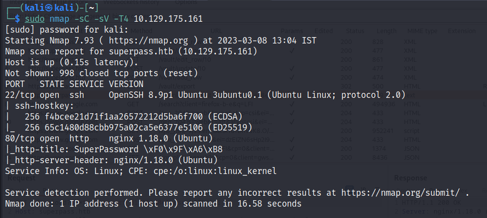
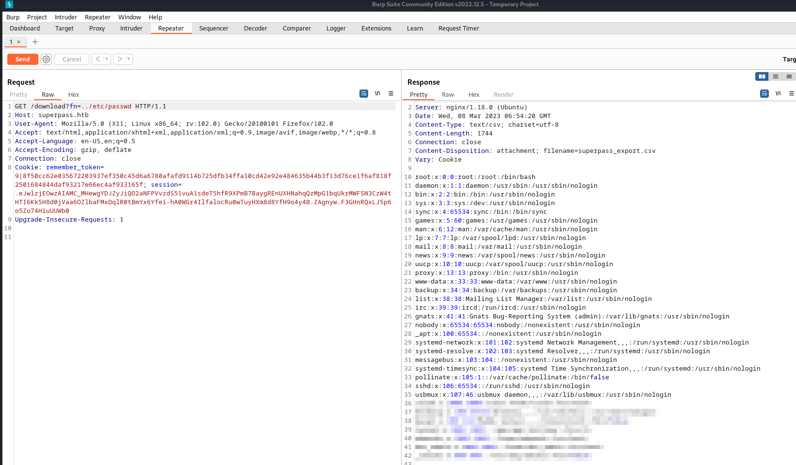
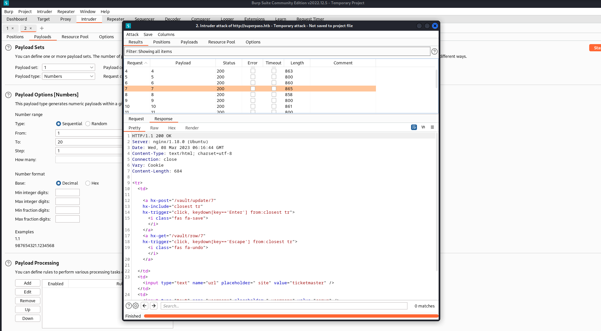
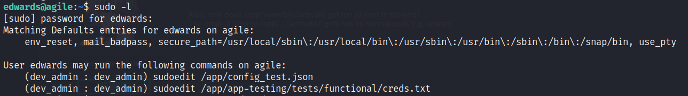

# Agile

This is still an active seasonal machine in HTB. So I will just share the outline of the process I used. This writeup is more of a way to help myself understand the process.

First we start with namp scan:

<figure><figcaption></figcaption></figure>

We find that port 80 & 22 are open. Lets visit the website and browse it. \
Keep Burp proxy on so that all the URLs will get captured in Burp Proxy-HTTP History.

Here we find that the website is for saving passwords and exporting them. Register an account and try everything.

After checking in HTTP-History, we find 2 interesting URLs:\
\- The export URL is vulnerable to LFI.\
\- The update/delete password URL is vulnerable to IDOR.

<figure><figcaption></figcaption></figure>

We can use LFI to get the `/etc/passwd` file. With this we will get the usernames.\
Users: corum, edwards, dev\_admin.

Next, in Burp Suite Intruder, check the IDOR URL with a few numbers. This will get us the password for user **corum**.

<figure><figcaption></figcaption></figure>

With this we can login as corum via SSH and get the user flag.

For privellage escalation, check the processes running. There are 2 intersting services here:\
\- Chrome remote debugging port \
\- A dev app running at localhost with another port.

I used the dev app to get the credentials for user edwards. For this we need to port forward this port.&#x20;

For this we can use `chisel`. Once the port has been forwarded, visit `localhost:5555` and we can see the dev version of the website. This works same as the PROD version, so lets try IDOR on this.

We will get the credentials for edwards here. Use it to SSH into edwards's account.

Using sudo -l we can see 2 files that we can read with `sudoedit`.\
If we search for sudoedit vulnerabilities, there is a recent CVE for it.

<figure><figcaption></figcaption></figure>

**As per CVE**: The problem exists because a user-specified editor may contain a "--" argument that defeats a protection mechanism, e.g., an EDITOR='vim -- /path/to/extra/file' value.

So we can export our default editor value with "--" argument to open/edit /app/venv/bin/activate:\
`export EDITOR="nano -- /app/venv/bin/activate"`

This will give us the edit access for this file when we use it to open any file we found in `sudo -l.`

`sudo -u dev_admin sudoedit /app/config_test.json`

We can then add a reverse shell script to this file. Thus, when it gets executed (automatically, dont manually execute it!) we will get a root shell on our machine.

Once we get the root shell, we will get he root flag 🙂.

